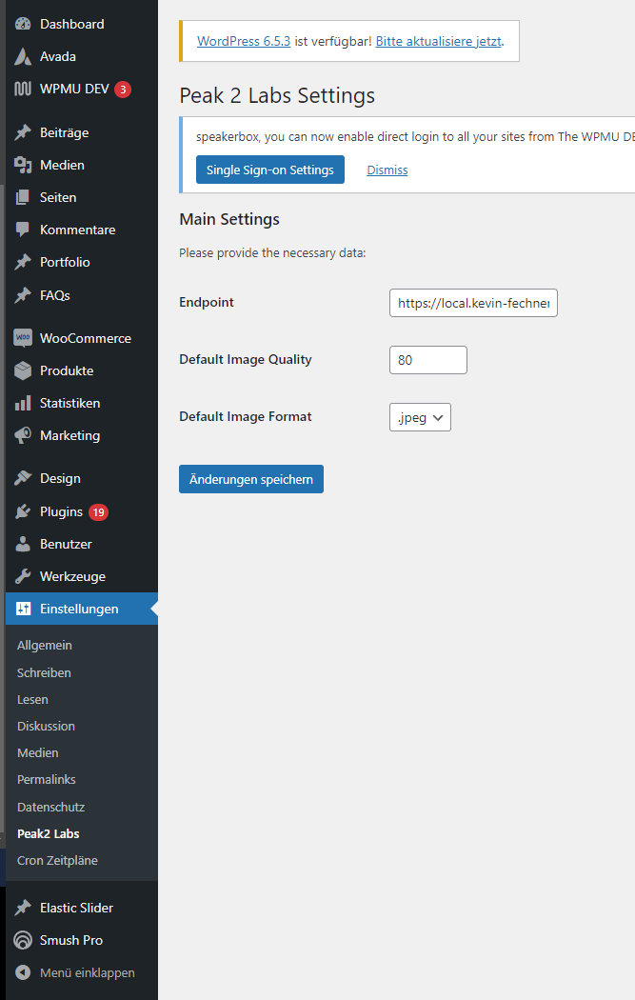

# Peak 2 Image Proxy - Wordpress Client (Avada)

## Setup

## How to use
If you want to use any other configuration than 
    - Quality of 80
    - Image Format ".jpeg"

you just need to use css classes for the avada image.
- Image Format: peak2-f-jpeg or peak2-f-png
- Image Quality: peak2-q-90

You can add default values in the settings tab of the wordpress dashboard.

